# 1. Contesto del Progetto

## Premessa

Il progetto **Cardiac Traceability Agent Framework** (CTAF) è un framework multi-agente basato su architettura BDI (Belief-Desire-Intention) che integra ragionamento simbolico in Jason/AgentSpeak con modelli linguistici di grandi dimensioni (LLM) per il supporto decisionale clinico nel dominio delle cardiopatie. L'obiettivo è coniugare la tracciabilità insita nei sistemi BDI con la flessibilità degli LLM, consentendo la generazione assistita di regole cliniche sottoposte a revisione umana.

Il framework adotta Jason come motore BDI simbolico, garantendo che ogni inferenza sia tracciabile e giustificabile. Il modulo LLM (basato su servizi come Groq e OpenRouter) supporta l'estrazione di rivendicazioni ("claims") dalla letteratura clinica e la bozza di regole, che vengono successivamente validate da un medico prima dell'integrazione nel sistema.

## Architettura del Sistema

*Sorgente del diagramma: [`img/architecture.mmd`](../img/architecture.mmd)*

## Problema

I sistemi decisionali basati su LLM presentano criticità note in ambito clinico:

- **Black-box**: le reti neurali profonde non forniscono spiegazioni intrinseche sulle decisioni assunte, violando il principio di trasparenza richiesto in contesti sanitari.
- **Non riproducibilità**: a parità di input, un LLM può produrre output diversi, rendendo impossibile la verifica ex-post del comportamento del sistema.
- **Assenza di revisione umana**: le architetture puramente neurali non prevedono meccanismi nativi di validazione da parte di un esperto del dominio.

In ambito clinico, questi limiti sono inaccettabili. La normativa vigente (Regolamento EU 2017/745 sui dispositivi medici, AI Act) richiede che i sistemi di supporto decisionale siano trasparenti, tracciabili e sottoposti a validazione umana. Un errore in un sistema di supporto clinico può avere conseguenze dirette sulla salute del paziente.

## Opportunità

La combinazione proposta cerca un compromesso concreto tra tracciabilità e flessibilità:

- **Motore BDI simbolico**: le inferenze sono tracciabili per progettazione. Ogni passo logico (selezione delle credenze, attivazione delle intenzioni, esecuzione dei piani) è registrato e può essere ispezionato a posteriori. Questo soddisfa i requisiti di trasparenza e riproducibilità.
- **LLM assistito ma revisionato**: il modello linguistico viene utilizzato esclusivamente in fase di authoring delle regole, producendo bozze che un medico revisiona e approva prima dell'implementazione. Il LLM non partecipa al processo decisionale clinico in esecuzione.
- **Tracciabilità end-to-end**: ogni regola nel sistema ha una provenienza documentata (articolo scientifico, bozza LLM, revisione umana, data di attivazione) accessibile tramite un'apposita console web.

## Stakeholder

| Ruolo | Attore | Responsabilità |
|---|---|---|
| Committente | Cardiologia di Forlì (reparto committente) | Commissiona il progetto, definisce la visione clinica, valuta e approva i deliverable |
| Project Manager | Studente (PM) | Pianificazione, coordinamento, monitoraggio, reporting |
| Core Team | Studenti (team di progetto) | Sviluppo framework, documentazione, testing |
| LLM Service | Groq / OpenRouter (esterno) | Erogazione API per modelli linguistici |
| Supervisore Clinico | Cardiologo referente (Cardiologia di Forlì) | Revisione e validazione delle regole cliniche |
| Utente Finale | Operatore sanitario | Destinatario del sistema (ruolo indiretto nel progetto) |

## Vincoli

- **Temporali**: durata del progetto limitata a un semestre accademico (febbraio-giugno 2026).
- **Economici**: budget zero. Tutti gli strumenti sono open-source o free-tier. I servizi LLM utilizzano crediti gratuiti o modalità di prova.
- **Human-in-the-loop**: ogni regola clinica deve essere approvata da un revisore umano prima del deployment. Non sono ammesse decisioni automatiche basate esclusivamente su LLM.
- **Separazione dalla tesi**: il progetto è un elaborato del corso di Project Management e non costituisce lavoro di tesi. Eventuali sviluppi futuri sono fuori dal perimetro del progetto.

## Scelta del PMLC Model: Iterative (Scrum) con adattamenti per R&D

Il PMLC model selezionato è **Scrum**, classificato come modello **Iterativo** (secondo la tassonomia Wysocki: Linear, Iterative, Adaptive, Extreme), con adattamenti specifici per la componente R&D del progetto.

### Nota sulla classificazione

Esiste un dibattito in letteratura sulla classificazione di Scrum: alcuni autori (Wysocki, 2014) lo considerano un modello Iterativo, altri (Highsmith, 2009) lo includono tra gli Adaptive. Questo progetto adotta la classificazione di Wysocki (Iterative), riconoscendo che Scrum struttura cicli di raffinamento su requisiti parzialmente noti, ma richiede adattamenti per gestire l'incertezza R&D della componente LLM.

### Analisi comparativa

| Modello | Motivazione della scelta/rifiuto |
|---|---|
| **Linear (Waterfall)** | Rifiutato. I requisiti non sono completamente noti all'avvio: l'integrazione tra LLM e BDI è un'attività di R&D con incognite tecniche. Un approccio lineare non consentirebbe di incorporare gli apprendimenti emersi durante lo sviluppo. |
| **Iterative (Scrum)** | **Selezionato**. La soluzione è parzialmente nota (il motore BDI è ben compreso), ma la parte di integrazione LLM presenta incognite. Scrum offre sprint brevi per gestire il rischio, cerimonie per il coordinamento del team, ispezioni frequenti tramite sprint review e adattamento continuo tramite retrospettive. La separazione dei ruoli (SM, PO, Team) si adatta alla struttura accademica. |
| **Adaptive (ASD)** | Rifiutato. ASD (Adaptive Software Development) è pensato per progetti con requisiti altamente volatili e cicli molto brevi. Il nostro progetto ha una base stabile (BDI) con una componente incerta (LLM), rendendo ASD eccessivamente flessibile per le nostre esigenze. |
| **Extreme (XP)** | Rifiutato. Le pratiche XP (pair programming, test-first, refactoring continuo) sono focalizzate sull'eccellenza tecnica piuttosto che sulla gestione del rischio e sul coordinamento di progetto. XP presuppone una stretta collaborazione col cliente che non è possibile nel contesto accademico. |

### Adattamenti di Scrum per la componente R&D

Per rendere Scrum applicabile a un contesto con elementi di R&D, sono stati introdotti i seguenti adattamenti:

| Adattamento | Descrizione | Rischio mitigato |
|---|---|---|
| **Management reserve (scope bank 10%)** | Una settimana di riserva (Sprint 5) e un budget di 8 story point per imprevisti tecnici non pianificabili a priori | R6 (timeline insufficiente), R4 (ambiguità claim) |
| **Risk-based sprint planning** | Ogni sprint include attività esplicitamente dedicate alla riduzione del rischio tecnico (es. validazione LLM nello Sprint 2) | R1 (API LLM), R4 (claim/regole inconsistenti) |
| **Technical spike** | Attività di esplorazione tecnica (prototipo bridge Jason-Python, test LLM API) prima dell'implementazione definitiva | R2 (integrazione Jason-Python) |
| **MoSCoW prioritization rigido** | Backlog prioritizzato per garantire la consegna dei Must-have anche in caso di tagli | R6 (timeline insufficiente) |
| **Validazione incrementale su golden case** | Ogni sprint produce un incremento validato su uno dei tre golden case (gc00, gc04, gc_gray_zone) | R5 (runtime Jason instabile) |

### Giustificazione

Il progetto presenta rischio medio-alto per la componente LLM (tempi di risposta, qualità delle bozze, affidabilità del servizio esterno). Scrum, con gli adattamenti sopra descritti, consente di:

1. **Validare incrementalmente**: ogni sprint produce un incremento di prodotto potenzialmente rilasciabile e validato su un golden case.
2. **Adattare il backlog**: le storie utente vengono ridefinite in base ai risultati degli sprint precedenti.
3. **Gestire il rischio**: le daily standup e la sprint review forniscono visibilità precoce su blocchi e problemi.
4. **Coinvolgere il committente**: la sprint review è il momento di ispezione formale con il referente della Cardiologia di Forlì.
5. **Assorbire l'incertezza R&D**: la management reserve e i technical spike permettono di gestire imprevisti senza impattare la data di consegna.

La scelta di Scrum con adattamenti per R&D è stata validata durante il Project Scoping Meeting #2.

## Riferimenti

- PMBOK Guide 7th Edition -- Principi di adattamento e stakeholder engagement
- Scrum Guide 2020 -- Framework, ruoli, artefatti, cerimonie
- AI Act (Proposta Regolamento UE 2021/0106) -- Requisiti per sistemi AI ad alto rischio
- Regolamento UE 2017/745 (MDR) -- Dispositivi medici e validazione clinica
