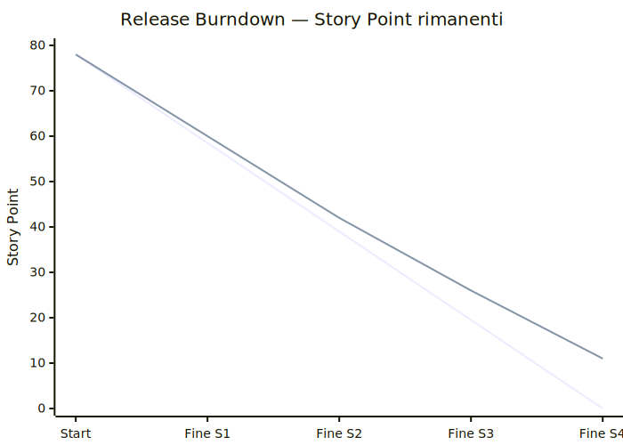

# 5. Monitoring e Controllo

## Release Burndown

Andamento dei story point rimanenti sull'intero progetto (78 SP totali). La linea reale
non raggiunge lo zero: 11 SP non critici sono stati rinviati (migliorie UI e documentazione).

*Linea superiore = trend ideale; linea inferiore = avanzamento reale. Sorgente del diagramma: [`img/burndown.mmd`](../img/burndown.mmd). Dettaglio giornaliero nelle tabelle per sprint qui sotto.*

## Burndown Chart per Sprint

Per ogni sprint è stato generato un burndown chart giornaliero basato sui story point rimanenti. I dati sono stati raccolti dal board di GitHub Projects e aggregati settimanalmente.

### Sprint 1 -- Burndown

| Giorno | Story Point Rimasti | Trend Ideale |
|---|---|---|
| Inizio (23 Mar) | 20 | 20 |
| Giorno 3 | 16 | 16 |
| Giorno 5 | 13 | 13 |
| Giorno 7 | 9 | 10 |
| Giorno 9 | 5 | 7 |
| Fine (5 Apr) | 2 | 4 |

**Commento**: Lo sprint ha seguito il trend ideale con uno scostamento minimo. Il setup iniziale ha richiesto più tempo del previsto, compensato nei giorni successivi. Due story point non completati (refactoring minore) sono stati riportati nel backlog.

### Sprint 2 -- Burndown

| Giorno | Story Point Rimasti | Trend Ideale |
|---|---|---|
| Inizio (6 Apr) | 22 | 22 |
| Giorno 3 | 18 | 17 |
| Giorno 5 | 15 | 13 |
| Giorno 7 | 12 | 9 |
| Giorno 9 | 7 | 5 |
| Fine (19 Apr) | 4 | 0 |

**Commento**: Lo sprint ha mostrato un ritardo nella prima settimana (problemi di configurazione DSPy). Il recupero nella seconda settimana non è stato sufficiente a completare tutti i punti. 4 story point riportati al backlog per lo Sprint 4.

### Sprint 3 -- Burndown

| Giorno | Story Point Rimasti | Trend Ideale |
|---|---|---|
| Inizio (20 Apr) | 18 | 18 |
| Giorno 3 | 15 | 14 |
| Giorno 5 | 12 | 10 |
| Giorno 7 | 8 | 6 |
| Giorno 9 | 3 | 2 |
| Fine (3 May) | 2 | 0 |

**Commento**: Buon andamento generale. Il TraceViewer ha richiesto un giorno aggiuntivo. 2 story point non critici (migliorie UI) sono stati rinviati.

### Sprint 4 -- Burndown

| Giorno | Story Point Rimasti | Trend Ideale |
|---|---|---|
| Inizio (4 May) | 18 | 18 |
| Giorno 3 | 16 | 14 |
| Giorno 5 | 12 | 10 |
| Giorno 7 | 8 | 6 |
| Giorno 9 | 5 | 2 |
| Fine (17 May) | 3 | 0 |

**Commento**: Lo sprint ha subito un ritardo significativo al giorno 5 a causa del problema di ambiguità dei claim (R4). La management reserve (assorbita dal scope bank al 10%) ha permesso di completare le attività critiche. 3 story point non completati (migliorie non critiche alla documentazione).

## Status Reports

Ad ogni sprint review è stato emesso uno status report seguendo il formato semaforico (stoplight).

### Sprint 1 -- Stato: Verde

| Dimensione | Valutazione | Note |
|---|---|---|
| Schedule | Verde | In linea con il piano, 2 SP non critici riportati |
| Budget | Verde | Costo zero confermato |
| Qualità | Verde | Test passati, codice reviewato |
| Rischi | Verde | R3 (ritardi accademici) monitorato, nessun impatto |
| Stakeholder | Verde | Committente soddisfatto |

### Sprint 2 -- Stato: Verde

| Dimensione | Valutazione | Note |
|---|---|---|
| Schedule | Giallo | Ritardo di 4 SP, recuperabile nello sprint successivo |
| Budget | Verde | Costo zero, crediti LLM sufficienti |
| Qualità | Verde | Pipeline funzionante, 2 claim ambigui documentati |
| Rischi | Verde | R1 (rate limit) gestito con fallback, R2 monitorato |
| Stakeholder | Verde | Committente soddisfatto, richiesto miglioramento ambiguità |

*Nota: nonostante un leggero ritardo, lo sprint è stato classificato Verde perché il ritardo era recuperabile e non critico.*

### Sprint 3 -- Stato: Verde

| Dimensione | Valutazione | Note |
|---|---|---|
| Schedule | Verde | 2 SP non critici rinviati |
| Budget | Verde | Costo zero |
| Qualità | Verde | Console funzionante, test utente superati |
| Rischi | Verde | Nessun rischio attivato |
| Stakeholder | Verde | Committente soddisfatto |

### Sprint 4 -- Stato: Giallo

| Dimensione | Valutazione | Note |
|---|---|---|
| Schedule | Giallo | Ritardo per problema ambiguità (R4), assorbito da management reserve |
| Budget | Verde | Costo zero, riserve non utilizzate (solo buffer temporale) |
| Qualità | Verde | Golden case validato, 9/10 test passati |
| Rischi | Giallo | R4 attivato, mitigato con successo |
| Stakeholder | Verde | Consegna accettata dal committente |

## SPOC -- Single Point of Contact e Metriche

Il SPOC è stato il Project Manager, unico punto di contatto per il committente e per i report di progetto.

### SPI (Schedule Performance Index) e CPI (Cost Performance Index)

| Sprint | EV | PV | AC | SPI | CPI |
|---|---|---|---|---|---|
| Sprint 1 | 18 | 20 | 18 | 0.90 | 1.00 |
| Sprint 2 | 18 | 22 | 18 | 0.82 | 1.00 |
| Sprint 3 | 16 | 18 | 16 | 0.89 | 1.00 |
| Sprint 4 | 15 | 18 | 15 | 0.83 | 1.00 |
| **Cumulativo** | **67** | **78** | **67** | **0.86** | **1.00** |

*EV = Earned Value (story point completati), PV = Planned Value (story point pianificati), AC = Actual Cost (costo zero in EUR, misurato in SP spesi).*

Il calcolo EVM (SPI, CPI, SV, CV) con formule live è nel foglio allegato:
[`documentazione/allegati/EVM_SPI_CPI.xlsx`](../documentazione/allegati/EVM_SPI_CPI.xlsx).

**Interpretazione**: SPI cumulativo di 0.86 indica che il progetto ha completato l'86% del lavoro pianificato. Il CPI di 1.00 riflette l'assenza di costi diretti. La variazione dello schedule è attribuibile alla complessità non prevista della pipeline LLM e alla gestione delle ambiguità.

## Stoplight Reports

| Sprint | Stato | Sintesi |
|---|---|---|
| Sprint 1 | 🟢 Verde | Tutte le dimensioni sotto controllo |
| Sprint 2 | 🟢 Verde | Leggero ritardo assorbibile |
| Sprint 3 | 🟢 Verde | Esecuzione regolare |
| Sprint 4 | 🟡 Giallo | Rischio R4 attivato, gestito con riserva |

### Legenda

- **Verde**: Tutto in linea con il piano, nessuna azione correttiva necessaria
- **Giallo**: Scostamento contenuto, azioni correttive in atto, rischio monitorato
- **Rosso**: Scostamento significativo, necessario intervento immediato

## Issue Log Management

| ID | Data | Descrizione | Impatto | Priorità | Stato | Risoluzione |
|---|---|---|---|---|---|---|
| ISS-001 | 25 Mar | Configurazione Jason su Windows | Setup ritardato di 1.5 gg | Media | Chiuso | Soluzione con Docker |
| ISS-002 | 27 Mar | Dipendenza ciclica piani BDI | Blocco sviluppo agenti | Alta | Chiuso | Redesign interfaccia agenti |
| ISS-003 | 9 Apr | DSPy richiede Python 3.11+ | Ritardo configurazione | Media | Chiuso | Aggiornamento ambienti |
| ISS-004 | 11 Apr | Formato output LLM inconsistente | Bozze regole non valide | Alta | Chiuso | Post-processore aggiunto |
| ISS-005 | 13 Apr | Rate limit Groq superato | Pipeline bloccata 2h | Alta | Chiuso | Fallback OpenRouter attivato |
| ISS-006 | 21 Apr | Scelta libreria grafica per tracce | Decisione ritardata di 1gg | Bassa | Chiuso | Adottata react-mermaid |
| ISS-007 | 28 Apr | Parsing JSON tracce complesso | Ritardo TraceViewer | Media | Chiuso | Libreria JSON viewer |
| ISS-008 | 6 May | Discrepanza formato dati BDI-LLM | Blocco integrazione | Alta | Chiuso | Interfaccia di trasformazione |
| ISS-009 | 10 May | ambiguità claim clinici (R4) | Regole non utilizzabili | Alta | Chiuso | Post-processore disambiguazione (management reserve) |

## Risk Monitoring e Attivazione Mitigazioni

| Rischio | Monitoraggio | Attivazione | Esito |
|---|---|---|---|
| R1 -- Indisponibilità LLM | Test settimanali disponibilità provider | Attivato giorno 13 (rate limit Groq) | Fallback OpenRouter funzionante |
| R2 -- Integrazione BDI-LLM | Test di integrazione giornalieri | Non attivato | Prevenuto da prototipo preliminare |
| R3 -- Ritardi accademici | Verifica presenza team ogni daily | Attivato parzialmente (sprint 4, esami) | Assorbito da buffer |
| R4 -- Ambiguità claims | Analisi output LLM ogni review | Attivato giorno 10 maggio | Mitigato con management reserve |
| R5 -- Incompatibilità librerie | Verifica versioni in CI/CD | Non attivato | Prevenuto da Docker |
| R6 -- Timeline insufficiente | Avanzamento sprint vs milestone | Attivato parzialmente (Sprint 4) | Ritardo assorbito da management reserve |

## Scope Bank e Change Management

### Scope Bank

Uno scope bank del 10% (8 story point su 78) è stato riservato per gestire imprevisti. Durante lo Sprint 4, 2 story point dello scope bank sono stati utilizzati per il post-processore di disambiguazione claim.

| Sprint | Scope Iniziale | Scope Aggiunto | Scope Rimosso | Scope Finale |
|---|---|---|---|---|
| Sprint 1 | 20 | 0 | 0 | 20 |
| Sprint 2 | 22 | 0 | 0 | 22 |
| Sprint 3 | 18 | 0 | 2 (migliorie UI) | 16 |
| Sprint 4 | 18 | 2 (da scope bank) | 3 (migliorie doc) | 17 |

### Change Management Process

Il processo di change management ha seguito questi passaggi:

1. **Identificazione del cambiamento** (segnalato da un membro del team o dal committente)
2. **Valutazione di impatto** da parte del PM (tempo, costi, qualità, rischi)
3. **Registrazione nel Change Log**
4. **Decisione** (approvato / respinto / rinviato)
5. **Implementazione** (se approvato, con priorità MoSCoW)

| ID | Data | Richiesta | Impatto | Decisione | Note |
|---|---|---|---|---|---|
| CHG-001 | 8 Apr | Aggiungere supporto OpenRouter come provider secondario | Minore (2h) | Approvato | Mitigazione R1 |
| CHG-002 | 22 Apr | Sostituire libreria grafica tracce | Minore (1gg) | Approvato | Da react-flow a react-mermaid |
| CHG-003 | 10 May | Aggiungere post-processore disambiguazione | Medio (2gg) | Approvato | Assorbito da scope bank |
| CHG-004 | 14 May | Ridurre test di integrazione da 15 a 10 scenari | Minore | Approvato | Priorità su documentazione |

## Gestione del Ritardo -- Sprint 4

Durante lo Sprint 4, il rischio R4 (ambiguità claim clinici) si è materializzato. Due claim generati dalla pipeline LLM presentavano ambiguità semantiche che impedivano la traduzione automatica in regole AgentSpeak valide.

**Impatto**: 2 giorni di ritardo sul flusso end-to-end.

**Azioni correttive**:
- Attivazione della management reserve (2 story point dallo scope bank)
- Implementazione di un post-processore che classifica i claim in: "chiari", "ambigui", "non validi"
- I claim ambigui vengono marcati per revisione umana prioritaria
- I claim non validi vengono rigettati con motivazione

**Esito**: Il ritardo è stato assorbito senza impattare la data di consegna del 17 maggio. Il golden case gc04 è stato validato con tutti i componenti integrati.
