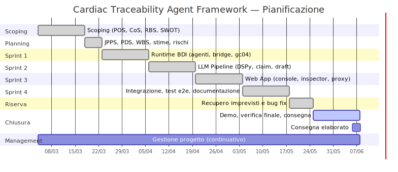

# Gantt — CTAF

## Diagramma di Gantt (per sprint)

*Sorgente: [`img/gantt.mmd`](../img/gantt.mmd)*

## Milestone

| Data | Milestone | Deliverable |
|---|---|---|
| 2026-03-04 | Kick-off | Team formato, repository creato |
| 2026-03-19 | Scoping e Planning completati | POS, CoS, RBS, SWOT, PDS, WBS approvati |
| 2026-04-05 | Sprint 1 — Runtime BDI | 4 agenti Jason funzionanti su gc04 |
| 2026-04-19 | Sprint 2 — LLM Pipeline | Pipeline DSPy su 3 casi d'uso |
| 2026-05-03 | Sprint 3 — Web App | Frontend e backend integrati |
| 2026-05-17 | Sprint 4 — Integrazione | Test e2e superati sui 3 golden case; accettazione prodotto |
| 2026-05-24 | Sprint 5 — Riserva | Buffer per imprevisti assorbito |
| 2026-06-07 | Consegna finale | Elaborato completo (14 artefatti + report) |
