# Project Network Diagram — CTAF

## Dipendenze tra Sprint

*Sorgente: [`img/network.mmd`](../img/network.mmd)*

Il percorso critico (in verde/arancione) attraversa Sprint 1 -> 2 -> 4 -> 6. Lo Sprint 3 (web app) è in parallelo non critico.

## Diagramma di Rete (macro-fasi)

*Sorgente: [`img/network_phases.mmd`](../img/network_phases.mmd)*

## Tabella Attività, Durate e Dipendenze

| ID | Attività | Durata (settimane) | Dipendenza |
|---|---|---|---|
| 1.1 | Requisiti e Scoping | 1 | — |
| 1.2 | Progettazione | 2 | 1.1 |
| 1.3 | Runtime BDI | 4 | 1.2 |
| 1.4 | LLM Pipeline | 3 | 1.2 |
| 1.5 | Web App | 3 | 1.2 |
| 1.6 | Integrazione e Test | 2 | 1.3, 1.4, 1.5 |
| 1.7 | Documentazione | 1 | 1.6 |
| 1.8 | Gestione Progetto | 14 (continuativo) | — |

## Percorso Critico

**Percorso critico:** 1.2 Progettazione (2 sett) → 1.3 Runtime BDI (4 sett) → 1.6 Integrazione (2 sett) → 1.7 Documentazione (1 sett).
**Durata totale: 9 settimane** (dal 16/03 al 18/05).

Nota: 1.1 Requisiti e Scoping precede il percorso critico (1 settimana, dal 09/03). Durata complessiva del percorso critico: 9 settimane, con 1 settimana di riserva (buffer) verso la deadline del 07/06/2026.
