# Requirements Breakdown Structure — CTAF

*Diagramma: [`img/rbs.mmd`](../img/rbs.mmd) → `img/rbs.svg`*

## Gerarchia dei Requisiti

**L0 — Obiettivo:** framework multi-agente BDI per supporto decisionale clinico tracciabile.

- **L1 · Runtime BDI (Jason/AgentSpeak)**
    - L2 · Ciclo agente BDI
        - L3 · Perceive: acquisizione input clinico da file JSON
        - L3 · Deliberate: selezione intenzione basata su regole cliniche
        - L3 · Means-End: piano d'azione per raccomandazione
        - L3 · Execute: output raccomandazione verso tracciabilità
    - L2 · Agenti del sistema
        - L3 · runtime_coordinator: orchestrazione e export tracce
        - L3 · case_reasoner: esecuzione regole approvate
        - L3 · trace_guardian: meta-regole di sicurezza
        - L3 · care_planner: pianificazione prossimi step
    - L2 · Comunicazione inter-agente
        - L3 · Scambio messaggi Jason (tell/ask)
        - L3 · Protocollo di coordinamento
- **L1 · LLM Pipeline**
    - L2 · Estrazione regole cliniche da testo
        - L3 · Parsing linee guida ESC (input testuale)
        - L3 · Generazione regole strutturate (JSON schema)
        - L3 · Validazione sintattica delle regole
    - L2 · Valutazione caso clinico
        - L3 · Matching caso-clinico vs regole estratte
        - L3 · Generazione bozza raccomandazione
        - L3 · Calcolo confidenza
    - L2 · Bridge Jason-Python
        - L3 · Chiamata HTTP da Jason a processo Python
        - L3 · Formattazione risposta JSON per agenti
- **L1 · Web App Review**
    - L2 · Backend (API)
        - L3 · Endpoint REST per raccomandazioni
        - L3 · Persistenza su db locale (SQLite)
        - L3 · Autenticazione revisore (base)
    - L2 · Frontend (React)
        - L3 · Dashboard raccomandazioni in attesa
        - L3 · Dettaglio raccomandazione + traccia
        - L3 · Pulsanti Approva / Rifiuta con commento
        - L3 · Storico revisioni completate
    - L2 · Notifiche
        - L3 · Webhook verso agente dopo review
        - L3 · Aggiornamento traccia con esito revisione
- **L1 · Tracciabilità e Spiegazione**
    - L2 · Justification Tree
        - L3 · Registrazione ciclo BDI (belief, goal, plan)
        - L3 · Collegamento regola clinica utilizzata
        - L3 · Esito revisione umana
    - L2 · Generazione report
        - L3 · Esportazione Markdown
        - L3 · Visualizzazione HTML navigabile
    - L2 · Audit log
        - L3 · Log cronologico eventi
        - L3 · Verifica integrità traccia

## Requisiti Non Funzionali

| ID | NFR | Descrizione | Target |
|---|---|---|---|
| NFR1 | Human-in-the-loop | Le regole sono eseguite dal runtime solo se approvate da un revisore umano | 0 regole non approvate in esecuzione |
| NFR2 | Tracciabilità | Ogni decisione produce una traccia simbolica (regola, fonte, input, output) | 100% decisioni tracciate |
| NFR3 | Spiegazioni groundate | Le spiegazioni si basano sulle fonti approvate, non su RAG aperto | Ogni traccia collegata a una fonte |
| NFR4 | Modularità | Ogni componente è sostituibile indipendentemente | Interfacce documentate |
| NFR5 | Portabilità | Il sistema è eseguibile su Windows, macOS e Linux | Build unica con Docker |
| NFR6 | Performance | Il ciclo BDI + LLM + traccia si completa in < 30 secondi | Cronometraggio su 3 scenari |
| NFR7 | Affidabilità | Il sistema gestisce gracefully errori LLM e input malformati | Test di fault injection |
